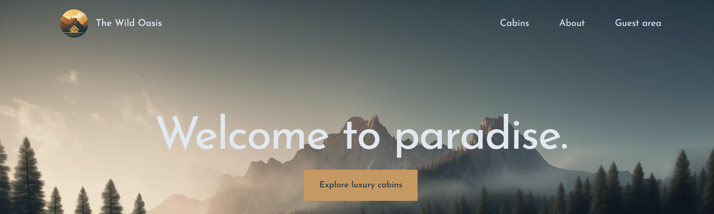
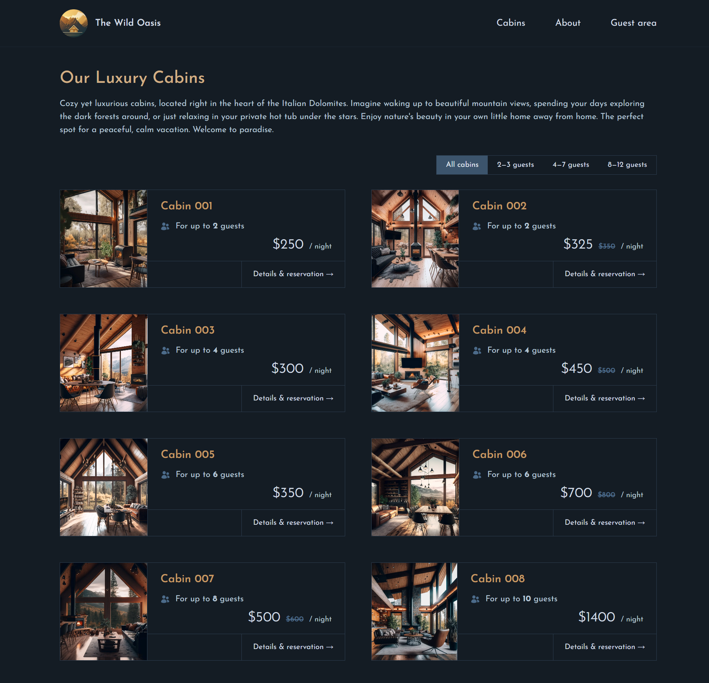
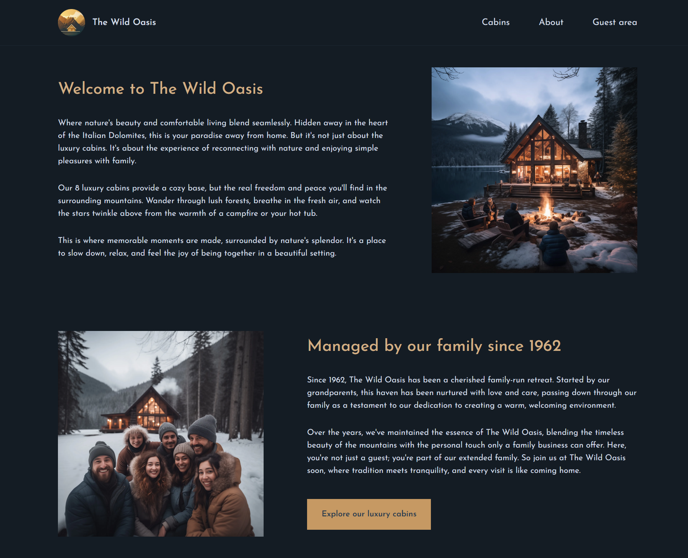

# The Wild Oasis 🌲

A modern hotel booking web application for a boutique collection of luxury cabins. Guests can browse cabins, check real-time availability, make reservations, and manage their bookings through a clean, fully responsive interface.

**Live demo:** [the-wild-oasis-website-demo-two-steel.vercel.app](https://the-wild-oasis-website-demo-two-steel.vercel.app/)

---

## ✨ Features

- **Browse cabins** with detailed descriptions, capacity, pricing, and image galleries
- **Filter cabins** by guest capacity (2–3, 4–7, 8–12 guests)
- **Real-time availability** and date-range selection for reservations
- **Authentication** via Google Sign-In (NextAuth)
- **Reservation management** — create, view, update, and cancel your bookings
- **Guest profile** — update personal details used at check-in
- **Server-side rendering & dynamic routing** with the Next.js App Router
- **Fully responsive** layout for desktop, tablet, and mobile

---

## 📸 Screenshots

### Home


### Cabins


### About


---

## 🛠 Tech Stack

| Layer | Technology |
|---|---|
| Framework | [Next.js 14](https://nextjs.org/) (App Router, Server Components, SSR) |
| UI | [React 18](https://react.dev/), [Tailwind CSS](https://tailwindcss.com/) |
| Auth | [NextAuth.js v5](https://authjs.dev/) (Google provider) |
| Database & Backend | [Supabase](https://supabase.com/) |
| Dates | [react-day-picker](https://daypicker.dev/) + [date-fns](https://date-fns.org/) |
| Icons | [Heroicons](https://heroicons.com/) |
| Deployment | [Vercel](https://vercel.com/) |

---

## 🚀 Getting Started

### Prerequisites

- Node.js 18.17 or later
- A [Supabase](https://supabase.com/) project
- Google OAuth credentials (from the [Google Cloud Console](https://console.cloud.google.com/))

### Installation

```bash
# Clone the repository
git clone https://github.com/solomiasyhlova/the-wild-oasis-website.git
cd the-wild-oasis-website

# Install dependencies
npm install
```

### Environment Variables

Create a `.env.local` file in the project root:

```env
# Supabase
SUPABASE_URL=your_supabase_url
SUPABASE_KEY=your_supabase_key

# NextAuth
AUTH_SECRET=your_auth_secret
AUTH_GOOGLE_ID=your_google_client_id
AUTH_GOOGLE_SECRET=your_google_client_secret

NEXTAUTH_URL=http://localhost:3000
```

> Adjust the variable names to match those referenced in your `auth.js` and Supabase config if they differ.

### Run Locally

```bash
npm run dev
```

Open [http://localhost:3000](http://localhost:3000) in your browser.

### Available Scripts

| Script | Description |
|---|---|
| `npm run dev` | Start the development server |
| `npm run build` | Build for production |
| `npm run start` | Start the production server |
| `npm run lint` | Run ESLint |

---

## 📁 Project Structure

```
the-wild-oasis-website/
├── app/              # Routes, layouts, server components & data services
├── public/           # Static assets (images, icons, screenshots)
├── middleware.js     # Route protection / auth middleware
├── next.config.mjs   # Next.js configuration
└── tailwind.config.js
```

---

## 🌐 Deployment

The app is deployed on **Vercel**. Push to the `main` branch (or connect the repo in the Vercel dashboard) and add the environment variables above in your project settings to deploy.

---

## 📄 License

This project was built for learning and portfolio purposes.
